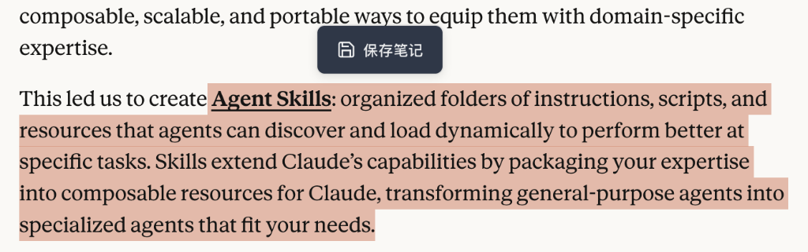
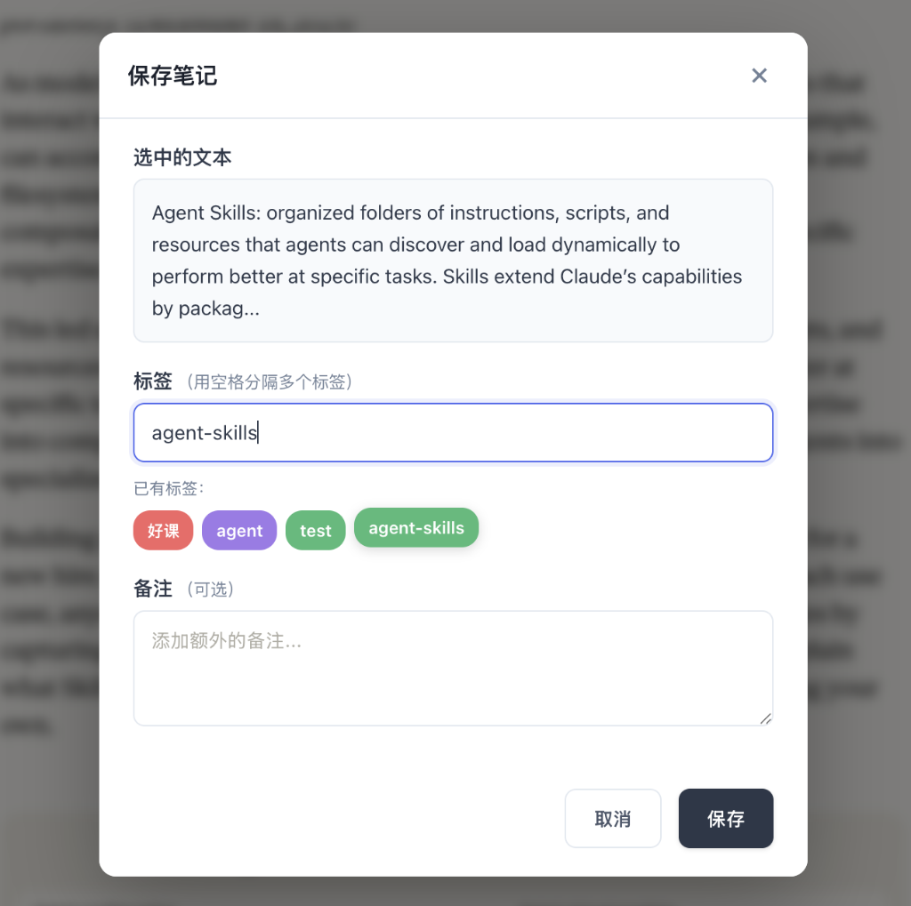
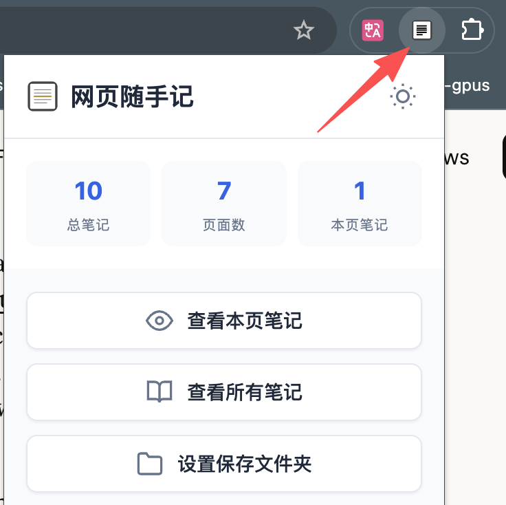
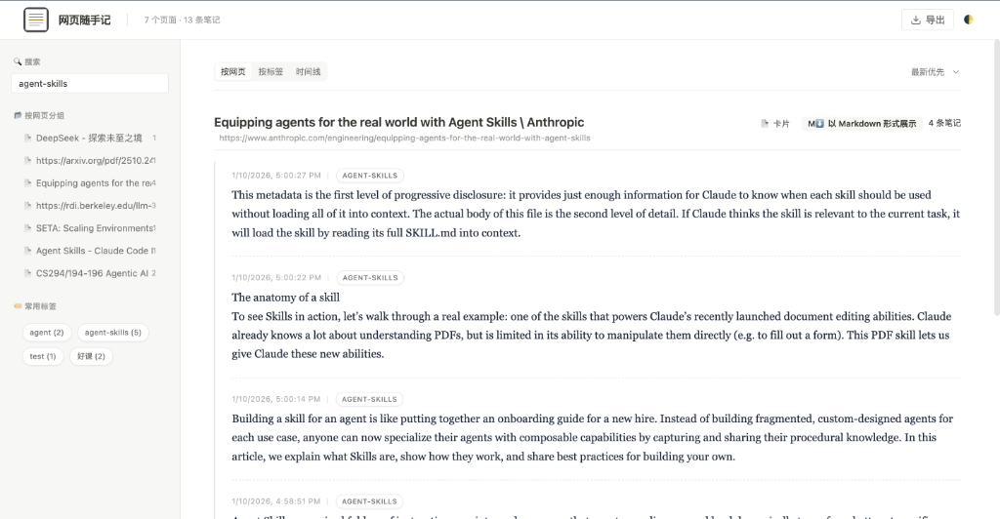

# 网页随手记 (Web Notes)

> 追求随性、方便、简约的网页记录体验  
> Prompted by **[beyondguo](https://github.com/beyondguo)** · Created by **Antigravity**.

一个轻量级的 Chrome 浏览器扩展，让你在浏览网页时随手记录灵感、摘录重要内容。**所有笔记保存在本地 JSON 文件中**，数据完全由你掌控，无需担心隐私泄露。


---

## ✨ 核心功能

### 📝 快速记录
- **右键菜单保存**：选中文本后，点击"保存笔记"按钮，或者右键选择"保存为笔记"，快速记录
- **自动捕获信息**：自动保存网页标题、URL、时间戳等元数据
- **标签管理**：为笔记添加标签，方便后续检索

### 📊 多视图管理
- **按网页分组**：查看每个网页的所有笔记
- **按标签分类**：通过标签快速筛选相关笔记
- **时间线视图**：按时间顺序浏览所有笔记

### 🎨 现代化界面
- **深色/浅色模式**：支持主题切换，保护眼睛
- **侧边栏预览**：不离开当前页面即可查看笔记
- **全屏管理页面**：提供完整的笔记管理体验

### 💾 本地存储
- **浏览器本地存储**：使用 `chrome.storage.local` 快速访问
- **本地 JSON 文件**：所有笔记自动保存到本地 JSON 文件，数据完全由你掌控
- **文件系统同步**：可选择本地文件夹，实时同步笔记到 `web-notes.json` 文件
- **数据导出**：支持导出为 Markdown 或 JSON 格式，方便备份和迁移

### 📄 智能页面提取
- **一键提取页面内容**：自动提取网页主要内容，转换为干净的 Markdown 格式
- **智能过滤噪音**：自动过滤侧边栏、广告、导航栏等无关内容
- **结构化输出**：保留标题层级、列表、表格、代码块等结构
- **后台自动化**：点击按钮后自动在后台打开网页、提取内容、关闭标签页
- **AI 友好格式**：输出的 Markdown 格式节省 50-70% tokens，适合 LLM 处理
- **元数据提取**：自动提取标题、作者、发布时间、网站名等信息

### 🤖 AI 阅读助手 ✨ NEW
- **侧边栏 AI 对话**：在侧边栏中与 AI 讨论当前网页内容，不离开页面
- **自动内容提取**：AI 自动读取页面内容并提供摘要
- **流式响应**：实时显示 AI 回复，体验流畅
- **Markdown 渲染**：AI 回复支持完整 Markdown 格式（代码块、列表、粗体等）
- **对话缓存**：关闭侧边栏后再打开，自动恢复之前的对话
- **多 API 支持**：支持 OpenAI、Anthropic、Gemini 等多种 AI 服务商
- **自定义配置**：可配置 API Key、模型、Base URL 等参数

---

## 🚀 快速开始

### 安装

1. **克隆或下载项目**
   ```bash
   git clone https://github.com/beyondguo/web-notes-extension.git
   cd web-notes-extension
   ```

2. **加载到 Chrome**
   - 打开 Chrome 浏览器，访问 `chrome://extensions/`
   - 开启右上角的 **"开发者模式"**
   - 点击 **"加载已解压的扩展程序"**
   - 选择项目根目录

3. **开始使用**
   - 在任意网页选中文本
   - 右键选择 **"保存为笔记"**
   - 添加标签（可选）并保存

### 配置本地 JSON 文件同步（推荐）

为了更好地管理和备份笔记，建议配置本地文件夹同步：

1. 点击扩展图标打开弹窗
2. 点击 **"设置保存文件夹"**
3. 选择本地文件夹并授权
4. 所有笔记将实时同步到该文件夹的 `web-notes.json` 文件中
5. 你可以用任何文本编辑器打开 JSON 文件查看或编辑笔记

### 配置 AI 功能

1. 点击扩展图标 → **"⚙️ 设置"**
2. 选择 AI 服务商（OpenAI / Anthropic / Gemini / 自定义）
3. 输入对应的 API Key
4. 点击 **"测试连接"** 确认配置正确
5. 保存设置后即可使用 AI 功能

---

## 📖 使用指南

### 💾 保存笔记

#### 步骤 1：选中文本并点击保存按钮

在网页上选中要保存的文本，会自动弹出"保存笔记"按钮，点击即可。



#### 步骤 2：添加标签并保存

在弹出的对话框中：
- 查看选中的文本
- 添加标签（用空格分隔多个标签）
- 可选择已有标签快速添加
- 添加备注（可选）
- 点击"保存"按钮或直接按 **Enter** 键保存



---

### 📊 查看笔记

#### 步骤 3：打开扩展弹窗

点击浏览器工具栏的扩展图标，查看笔记统计信息：
- 总笔记数
- 页面数
- 本页笔记数



#### 步骤 4：查看所有笔记

点击"查看所有笔记"按钮，进入完整的笔记管理页面：



在这里你可以：
- 🔍 **搜索笔记**：输入关键词或标签
- 📂 **按网页分组**：查看每个网页的笔记
- 🏷️ **按标签筛选**：点击标签快速筛选
- ⏱️ **时间线视图**：按时间顺序浏览
- ✏️ **编辑笔记**：修改内容和标签
- 🗑️ **删除笔记**：移除不需要的笔记
- 📤 **导出数据**：导出为 Markdown 或 JSON 格式

---

### 📄 提取页面内容

#### 方式 1：通过插件面板提取

1. 打开任意网页
2. 点击浏览器工具栏的扩展图标
3. 点击 **"📄 提取页面内容"** 按钮
4. 等待提取完成（会显示成功提示）
5. 在"全部笔记"页面点击 **"查看该网页全部内容"** 查看

#### 方式 2：在笔记页面直接提取

1. 打开"全部笔记"页面
2. 找到想要提取的网页分组
3. 点击 **"查看该网页全部内容"** 按钮
4. 系统会自动在后台打开网页、提取内容、关闭标签页
5. 提取完成后自动显示 Markdown 内容

**提取的内容包括**：
- 网页主要内容（自动过滤广告、导航栏等）
- 标题层级、列表、表格、代码块等结构
- 元数据（标题、作者、发布时间等）
- 干净的 Markdown 格式，适合 AI 处理

---

### 🤖 使用 AI 阅读助手

1. 在任意网页点击扩展图标
2. 点击 **"🤖 AI 阅读助手"** 按钮
3. 侧边栏会自动打开并切换到 AI 标签
4. 点击 **"开始对话"** 按钮
5. AI 会自动读取页面内容并提供摘要
6. 你可以继续提问，与 AI 讨论页面内容

**特色功能**：
- 🔄 **对话缓存**：关闭侧边栏后再打开，自动恢复对话
- ➕ **新对话**：点击页面信息旁的 "+" 按钮开始新对话
- 📝 **Markdown 渲染**：AI 回复完整支持 Markdown 格式

---

## 🛠️ 技术栈

- **Manifest V3**：最新 Chrome 扩展标准
- **核心技术**：纯 HTML + CSS + JavaScript
- **内容提取**：
  - Mozilla Readability.js：智能提取网页主要内容
  - Turndown.js：HTML 转 Markdown
- **AI 集成**：
  - 支持 OpenAI / Anthropic / Gemini API
  - 流式响应（SSE）
  - Marked.js：Markdown 渲染
- **存储方案**：
  - `chrome.storage.local`：浏览器本地存储
  - File System Access API：本地文件系统同步
- **设计风格**：现代化扁平设计，支持深色模式

---

## 📁 项目结构

```
web-notes-extension/
├── manifest.json          # 扩展配置文件
├── libs/                  # 第三方库
│   ├── readability.min.js # Mozilla Readability
│   ├── turndown.min.js    # Turndown (HTML to Markdown)
│   └── marked.min.js      # Marked (Markdown to HTML)
├── background/            # 后台服务
│   └── service-worker.js
├── content/               # 内容脚本
│   ├── content.js
│   ├── content.css
│   └── markdown-extractor.js  # Markdown 提取模块
├── popup/                 # 弹窗界面
│   ├── popup.html
│   ├── popup.css
│   └── popup.js
├── sidebar/               # 侧边栏（笔记 + AI 助手）
│   ├── sidebar.html
│   ├── sidebar.css
│   └── sidebar.js
├── pages/                 # 完整页面
│   ├── all-notes.html     # 笔记管理页
│   ├── all-notes.css
│   ├── all-notes.js
│   ├── settings.html      # AI 设置页
│   └── settings.js
├── shared/                # 共享资源
│   ├── styles.css         # 全局样式
│   ├── utils.js           # 工具函数
│   ├── storage.js         # 存储管理
│   ├── ai-service.js      # AI 服务接口
│   └── content-extractor.js  # 内容提取工具
└── icons/                 # 图标资源
```

---

## 🎯 路线图

### 已完成 ✅
- [x] 基础笔记保存功能
- [x] 标签管理
- [x] 多视图展示（网页/标签/时间线）
- [x] 深色模式支持
- [x] 本地文件同步
- [x] 数据导出（Markdown/JSON）
- [x] 智能页面内容提取（Markdown 格式）
- [x] **AI 阅读助手**（侧边栏对话、流式响应、Markdown 渲染）
- [x] **AI 配置页面**（多服务商支持）
- [x] **对话缓存**（自动保存和恢复对话）

### 计划中 🚧
- [ ] AI 自动总结笔记内容
- [ ] AI 自动提取和推荐标签
- [ ] AI 智能分类和整理
- [ ] **图片支持**：保存网页图片，支持截图和图片标注
- [ ] 笔记搜索优化（全文搜索、高级筛选）
- [ ] 云端同步支持（可选）
- [ ] 浏览器书签集成
- [ ] 快捷键支持

---

## 🤝 贡献

欢迎提交 Issue 和 Pull Request！

---

## 📄 许可证

MIT License

---

## 👨‍💻 作者

- **Prompted by**: [beyondguo](https://github.com/beyondguo)
- **Created by**: Antigravity (Gemini)

如果这个项目对你有帮助，欢迎点个 Star ⭐️
