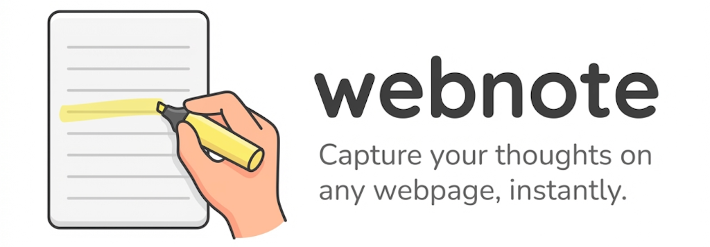
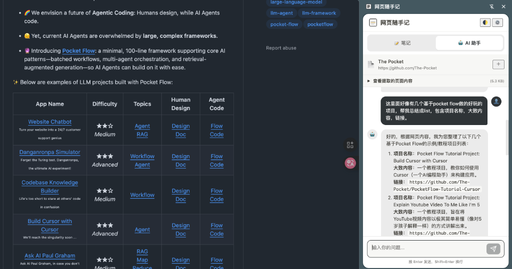

# 网页随手记 (webnote)

> 💡 **随性、方便、简约**的网页记录体验  
> Prompted by **[beyondguo](https://github.com/beyondguo)** · Created by **Antigravity**.

一个轻量级的 Chrome 扩展，集成了 **文本摘录** 与 **AI 网页助手**。所有数据保存在本地 JSON 文件中，安全且完全由你掌控。


---

## ✨ 核心亮点

### 1. 📝 极速摘录
在网页任意位置选中文本，右键点击 **"保存到<网页随手记>"**，即可快速记录灵感。支持添加标签和备注，方便通过侧边栏或管理页回顾。


### 2. 🏷️ 标签 + 随手评论
不只是划线，更能随时记下你的想法！
- **自定义标签**：为每条笔记添加多个标签，支持自动推荐。
- **随手评论**：保存时可添加备注，记录你的思考和灵感。


### 3. 🤖 AI 智能阅读助手
点击插件面板中的 **"跟 AI 聊本页内容"**，即可在侧边栏与 AI 讨论当前网页。
- **自动提取**：AI 自动读取网页正文并生成摘要。
- **一键保存**：**觉得 AI 说得好？直接选中 AI 的回复内容，右键即可保存为笔记！**
- **智能对话**：支持基于网页内容的深度问答。



### 4. 🔒 数据完全掌控
- **本地优先**：笔记存储在浏览器本地。
- **文件同步**：支持同步到本地硬盘的 `web-notes.json` 文件。
- **自由导出**：随时导出为 Markdown 或 JSON 格式。

---

## 🚀 快速开始

1. **获取代码**
   ```bash
   git clone https://github.com/beyondguo/web-notes-extension.git
   ```

2. **安装扩展**
   - Chrome 打开 `chrome://extensions/`
   - 开启右上角 **"开发者模式"**
   - 点击 **"加载已解压的扩展程序"**，选择项目目录

3. **配置 AI (可选)**
   - 点击插件图标 → **⚙️ 设置**
   - 输入 OpenAI / Anthropic / Gemini Key 即可开启 AI 助手功能

---

## 🛠️ 技术栈简介

- **Core**: Manifest V3, Vanilla JS (No Frameworks)
- **AI**: Stream Response, Markdown Support (Marked.js)
- **Extraction**: Mozilla Readability, Turndown.js
- **Storage**: `chrome.storage` + File System Access API

---

## 🤝 贡献与反馈

欢迎提交 Issue 或 PR！如果喜欢这个项目，欢迎点个 Star ⭐️
